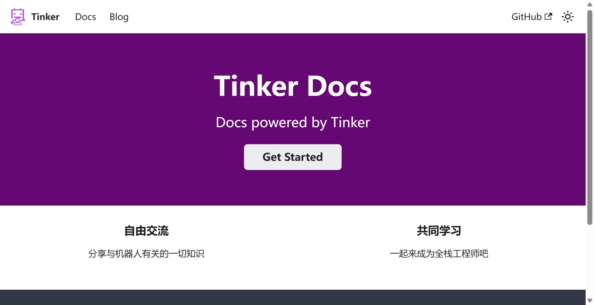

---
last_update:
  date: 4/8/2024
  author: Grange
---


# 从零开始的文档网站搭建——以Tinker Docs为例

无论是要搭建个人博客还是团队知识库，一个文档网站都是必不可少的。一个优秀的文档网站能让我们方便快捷地上传文档资料，清晰地组织文档架构，同时支持多语言、链接跳转、界面个性化等多种多样的功能。本文将以 [Tinker Docs](https://tinkerfuroc.github.io/tinkerdocs/) 的搭建过程为例，介绍如何基于 [Docusaurus](https://docusaurus.io/) 和 [Github Pages](https://pages.github.com/) 完成一个基本的文档网站的部署。

## 一、静态网站生成器

想要搭建文档网站，首先的问题就是——我要如何方便快捷地发布我的文档？毕竟，文档网站的核心是文档的内容产出，并不需要多么炫酷的前端界面。倘若对于我的每一份文档，我都需要为它写一套前端代码，来显示和组织其中的各个元素，这显然有点太过折磨人了。

为此，静态网站生成器应运而生。通过静态网站生成器，我们可以轻松地通过 Markdown 或其他轻量级标记语言来编写文档并发布至网站中，从而大大减小了文档网站的发布工作量。

想要理解静态网站生成器，我们首先需要知道什么是静态网站。静态网站是由静态网页组成的网站，这些网页是预先编写好的，存储在服务器上的文件，其中的每个文件都对应一个网页。当用户请求一个网页时，服务器会将对应的文件发送给用户的浏览器，将这一页面呈现出来。静态网页的内容在服务器上是固定的，不会因为用户的请求而改变。与静态网站相对的就是动态网站。动态网站的内容会根据用户的请求实时生成。当用户请求一个网页时，服务器会运行一些脚本，可能会查询数据库，然后生成对应的网页发送给用户。动态网站的内容会根据用户的请求、用户的输入、当前的时间等因素进行变化。

文档网站通常都属于静态网站。文档网站的主要功能是静态文档的呈现，对于动态交互等功能需求较少。这一特点使得静态网站生成器能很方便地将我们的文本文件转化为静态网站上的页面。

静态网站生成器的工作流程通常如下：

1. 用户在文本文件中编写内容，可能使用 Markdown 或其他轻量级标记语言。
2. 用户可能会使用一些模板，这些模板定义了网页的布局和样式。
3. 用户运行静态网站生成器，生成器读取文本文件和模板，生成静态 HTML 文件。
4. 生成的 HTML 文件可以直接部署到任何能够提供静态内容的 web 服务器上。

## 二、Docusaurus 简介

### 概览

市面上常用的静态网页生成器有很多，包括 [Hexo](https://hexo.io/docs/)（常用于搭建个人博客）、[MkDocs](https://www.mkdocs.org/)（常用于搭建技术文档）、[VuePress](https://vuepress.vuejs.org/)（由 Vue.js 支持的静态网站生成工具）等。Tinker Docs 采用了 [Docusaurus](https://docusaurus.io/) 作为静态网页生成器。

Docusaurus是一个由Facebook开发的开源静态网页生成器，支持编写技术文档、博客等多种功能。Docusaurus 对 React 和 Markdown 均有着较好的支持，这也使得它在 Markdown 的基础上能提供相当丰富的显示功能。

以下，我们将介绍 Docusaurus 的基本使用流程。

### 项目创建

我们可以使用`npx`来创建一个 Docusaurus 项目。（要求 Node.js 版本为 18.0 或更高版本，可以通过运行 `node -v` 进行检查）。使用`npx`的初始化命令（推荐使用）：

```shell
npx create-docusaurus@latest <website_name> classic
```

也可以选择其它包管理器进行初始化。

使用`npm`的初始化命令：

```shell
npm init docusaurus
```

使用`yarn`的初始化命令：

```shell
yarn create docusaurus
```

### 添加页面

Docusaurus 的典型项目结构如下（以项目`my-website`为例）：

```
my-website
├── blog
│   ├── 2019-05-28-hola.md
│   ├── 2019-05-29-hello-world.md
│   └── 2020-05-30-welcome.md
├── docs
│   ├── doc1.md
│   ├── doc2.md
│   ├── doc3.md
│   ├── subfold
│   │	├── _category.json
│   │	└── subdoc.md
│   └── mdx.md
├── src
│   ├── css
│   │   └── custom.css
│   └── pages
│       ├── styles.module.css
│       └── index.js
├── static
│   └── img
├── docusaurus.config.js
├── package.json
├── README.md
├── sidebars.js
└── yarn.lock
```

+ `/blog/` - 包含博客的 Markdown 文件。
+ `/docs/` - 包含文档的 Markdown 文件。可通过自定义 `sidebars.js` 改变`/docs/`中的文档在侧边栏的顺序。
+ `/src/` - 非文档文件，例如页面和自定义 React 组件。不必严格将非文档文件放在这里，但是将它们放在集中目录下可以更方便进行处理。
  + `/src/pages` - 此目录中的任何 JSX/TSX/MDX 文件都将转换为网站页面。
+ `/static/` - 静态目录。这里的任何内容都将被复制到最终 `build` 目录的根目录中。
+ `/docusaurus.config.js` - 包含站点配置的配置文件。
+ `/package.json` - Docusaurus 网站是一个 React 应用程序，您可以在其中安装和使用需要的 npm 软件包。
+ `/sidebars.js` - 用来指定侧边栏中文档的顺序

如果要添加文档，只需向`/blog/`或`/docs/`中添加相应的 Markdown 或 React 文件，即可在网站中增添相应的页面。

如需对文档进行分类，只需在`/docs/`文件夹下新建子文件夹（如项目结构中的`/subfold/`），便可在网站中起到相应的文档归类作用。在子文件夹中可添加文件`_category_.json`，用以起到对整个子文件夹页面的组织、介绍作用。

Tinker Docs 中的`/docs/Hardware/_category_.json`文件：

```json
{
  "label": "硬件",
  "position": 2,
  "link": {
    "type": "generated-index",
    "description": "电路、机械结构设计相关知识"
  }
}
```

对应的子文件夹介绍页面：[硬件 | Tinker Docs](https://tinkerfuroc.github.io/tinkerdocs/docs/category/硬件)

### 本地预览

当完成文档编写后，在正式向网站发布之前，我们可以通过运行本地开发服务器来预览自己的网站，并实时进行更改。

我们可通过如下命令进行网站预览：

使用`npm`的命令：

```shell
cd <website_name>
npm run start
```

使用`yarn`的命令：

```shell
cd <website_name>
yarn run start
```

这样，一个浏览器窗口将会在`http://localhost:3000/<website_name>`打开，我们可预览自己的网站，并进行实时的更改。

### 构建网站

生成静态网站的最后一步就是对网站进行构建。构建网站的过程可以将我们的 Markdown 文档转化为`html`文件，从而生成我们需要的静态网页。

我们可通过如下命令进行网站构建：

使用`npm`的命令：

```shell
npm run build
```

使用`yarn`的命令：

```shell
yarn build
```

构建后的内容将在`/build`中生成，其中包含了由我们的 Markdown 文档转化而来的`html`文件。将`/build`文件夹中的内容复制到静态网站托管服务，从而实现网站部署。这也就进入了我们的下一章节——如何部署我们的网站。

## 三、基于 Github Pages 的网站部署

### 本地测试

当完成网站的构建后，在将网站部署到生产环境之前，我们可以先在本地测试构建后的网站是否正常。

我们可通过如下命令进行网站构建：

使用`npm`的命令：

```shell
npm run serve
```

使用`yarn`的命令：

```shell
yarn serve
```

如果运行正常，我们构建后的网站将会在`http://localhost:3000/<website_name>`打开，我们可检查自己的网站构建是否正常。

> 这里的`npm run serve`与上文的`npm run start`的区别是：`npm run serve` 呈现出的是在网站构建完成后`/build`文件夹中的静态页面，不支持实时的更改和预览；`npm run start`则是基于整个项目的网站预览，由项目文件夹生成，可以进行实时的更改和预览。

### 网站托管

在这之后，我们可以着手进行我们的网站托管。常见的托管方式包括以下两种：

1. 使用 Apache2, Nginx 等 HTTP 服务器进行自托管。
2. 基于 Jamstack 提供商进行托管（如 Netlify, Vercel, Github Pages 等）。

以下将主要介绍如何基于 Github Pages 完成网站的托管。这是一种简便、免费的网站部署方式，且可以非常方便地应用于其他 Github 项目。

通常，使用 Github Pages 发布网站的过程涉及两个仓库（或是两个分支）：包含源文件的分支，称为源分支；以及包含网站项目构建完成后的文件（也就是`/build/`）中的内容，准备通过 Github Pages 进行部署的分支，称为部署分支。

每个 GitHub 仓库都和一个 GitHub Pages 服务关联。其站点域名与仓库名关联如下：

+ 对于组织名或个人名是`my-org`的账号，如果其有一个名字为`my-org.github.io`的仓库，那个这个仓库经过 Github Pages 部署后的站点域名为 `https://my-org.github.io/` 。
+ 对于组织名或个人名是`my-org`的账号，如果其有一个名字不为`my-org.github.io`的仓库`my-project`，那个这个仓库经过 Github Pages 部署后的站点域名为`https://my-org.github.io/my-project/` 。

也就是说，组织或个人的每个仓库都可通过 Github Pages 进行部署，不过只有名为`my-org.github.io`的指定仓库经过 Github Pages 部署后可以作为网站的根目录`my-org.github.io`，其余名称的网站都只能作为`my-org.github.io`的子目录。

GitHub Pages会从默认分支（通常是`master` / `main`）或`gh-pages`分支中获取准备部署的文件（即`docusaurus build`的输出），该分支即为部署分支。Github Pages 也可选择发布该分支中的`/`（根目录）或是`/docs/`。部署 Docusaurus 网站时，我们一般选择发布根目录。 [tinkerdocs](https://github.com/tinkerfuroc/tinkerdocs) 仓库将`main`分支作为了源分支，将`gh-pages`分支作为了部署分支。其具体选项可在 [tinkerdocs->Settings->Pages](https://github.com/tinkerfuroc/tinkerdocs/settings/pages) 中查看与配置。

### 项目配置

在这之后，我们需要在`docusaurus.config.js`中完成一些与项目部署和 Github Pages 有关的配置，Tinker Docs 中与网站部署有关的配置具体如下：

```json
const config = {
  // Set the production url of your site here
  url: 'https://tinkerfuroc.github.io/',
  // Set the /<baseUrl>/ pathname under which your site is served
  // For GitHub pages deployment, it is often '/<projectName>/'
  baseUrl: '/tinkerdocs/',

  // GitHub pages deployment config.
  // If you aren't using GitHub pages, you don't need these.
  organizationName: 'tinkerfuroc', // Usually your GitHub org/user name.
  projectName: 'Tinker_docs', // Usually your repo name.
  trailingSlash: false,
  onBrokenLinks: 'throw',
  onBrokenMarkdownLinks: 'warn',
  ...
}
```

其中有一些需要注意的配置：

|属性|介绍|
| --------- | ------------------------------------------------------------ |
| `url`     | 网站的url。对于部署在 `https://my-org.com/my-project/` 的站点， `url` 是 `https://my-org.com/` 。 |
| `baseUrl` | 项目的基本 URL，末尾带有斜杠。对于部署在 `https://my-org.com/my-project/` 的站点， `baseUrl` 是 `/my-project/` 。 |
| `organizationName` | 拥有网站仓库的 GitHub 个人或组织。                           |
| `projectName`      | Github 上网站仓库的名称。                                    |
| `deploymentBranch` | 部署分支的名称。对于`projectName` 不以 `.github.io` 结尾的 GitHub Pages 存储库，它默认为 `gh-pages` 。否则，它需要明确指定。 |

### 网站部署

最后，我们就可以进入激动人心的网站部署环节了。Docusaurus 为我们提供了 `deploy` 命令，能自动完成构建项目、推送至仓库、发布网站等任务。

使用`bash`的命令：

```bash
GIT_USER=<GITHUB_USERNAME> yarn deploy
```

使用 Windows `cmd`的命令：

```powershell
cmd /C "set "GIT_USER=<GITHUB_USERNAME>" && yarn deploy"
```

使用 Windows `powershell`的命令：

```shell
cmd /C 'set "GIT_USER=<GITHUB_USERNAME>" && yarn deploy'
```

至此，我们就已完成了部署网站的全部过程！在浏览器中输入你的网址，你应该就能看见你的网站了。



### 使用 Github Actions 自动化部署

如果每一次要更新网站，我们都得在本地用命令行进行部署，这显然有些过于繁琐了，且不利于多人协作。有没有办法可以让我们实现一旦网站仓库有更新，就能立刻把新的网站发布出来呢？[GitHub Actions](https://docs.github.com/zh/actions) 就是一个很好的选择。

> GitHub Actions 是一种持续集成和持续交付 (CI/CD) 平台，可用于自动执行生成、测试和部署管道。 您可以创建工作流程来构建和测试存储库的每个拉取请求，或将合并的拉取请求部署到生产环境。

要使用 Github Actions ，我们需要撰写相应的工作流文件（`.yaml`或`.yml`格式），来让 Github Actions 为项目提供相应的工作流程。幸运的是，Docusaurus 已经为我们写好了相应的文件：

`.github/workflows/deploy.yml`

```yaml
name: Deploy to GitHub Pages

on:
  push:
    branches:
      - main
    # Review gh actions docs if you want to further define triggers, paths, etc
    # https://docs.github.com/en/actions/using-workflows/workflow-syntax-for-github-actions#on

jobs:
  build:
    name: Build Docusaurus
    runs-on: ubuntu-latest
    steps:
      - uses: actions/checkout@v4
        with:
          fetch-depth: 0
      - uses: actions/setup-node@v4
        with:
          node-version: 18
          cache: yarn

      - name: Install dependencies
        run: yarn install --frozen-lockfile
      - name: Build website
        run: yarn build

      - name: Upload Build Artifact
        uses: actions/upload-pages-artifact@v3
        with:
          path: build

  deploy:
    name: Deploy to GitHub Pages
    needs: build

    # Grant GITHUB_TOKEN the permissions required to make a Pages deployment
    permissions:
      pages: write # to deploy to Pages
      id-token: write # to verify the deployment originates from an appropriate source

    # Deploy to the github-pages environment
    environment:
      name: github-pages
      url: ${{ steps.deployment.outputs.page_url }}

    runs-on: ubuntu-latest
    steps:
      - name: Deploy to GitHub Pages
        id: deployment
        uses: actions/deploy-pages@v4
```

---

`.github/workflows/test-deploy.yml`

```yml
name: Test deployment

on:
  pull_request:
    branches:
      - main
    # Review gh actions docs if you want to further define triggers, paths, etc
    # https://docs.github.com/en/actions/using-workflows/workflow-syntax-for-github-actions#on

jobs:
  test-deploy:
    name: Test deployment
    runs-on: ubuntu-latest
    steps:
      - uses: actions/checkout@v4
        with:
          fetch-depth: 0
      - uses: actions/setup-node@v4
        with:
          node-version: 18
          cache: yarn

      - name: Install dependencies
        run: yarn install --frozen-lockfile
      - name: Test build website
        run: yarn build
```

这两个工作流文件可实现以下功能：

1. 当向 `main` 发出新的`pull request`时，有一个 Action 会检测网站是否能够成功构建，而不会真正进行部署。这一工作流被称为 `test-deploy` 。
2. 当`pull request`被合并到 `main` 分支或有人直接`push`到 `main` 分支时，网站将被构建并部署到 GitHub Pages。该作业将被称为 `deploy` 。

通过将这两个文件放入项目中的`.github/workflows/`文件夹并上传至 Github 仓库中，我们即可实现基于 Github Actions 的网站自动化部署。


---

限于篇幅原因，本文对于 Docusaurus 和 Github Pages 的介绍并未深入展开，感兴趣的同学可阅读官方文档（[Docusaurus](https://docusaurus.io/) 和 [Github Pages](https://pages.github.com/)）进一步学习。

Tinker Docs 在搭建过程中较多地参考了 [EESAST Docs | 清华大学电子工程系学生科协](https://docs.eesast.com/) ，在此向 EESAST 各位开发人员表达诚挚谢意。
